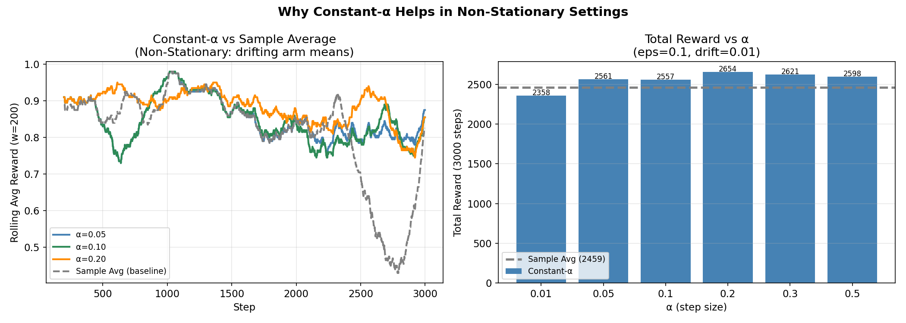
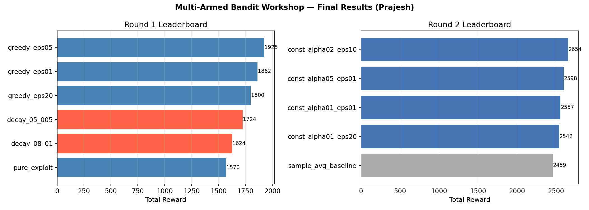

# 🎰 Multi-Armed Bandit Workshop

> Explore the **exploration–exploitation trade-off** in Reinforcement Learning through a gamified casino competition using ε-greedy agents.


## 📌 About

**Original Workshop by:** [ProfEspinosaAIML](https://github.com/ProfEspinosaAIML/MultiArmedBandit_Workshop)  
**Student Notebook by:** Prajesh Bhatt  
**Course:** CSCN8020 — Reinforcement Learning, Conestoga College  
**Date:** June 2026

---

## 🧠 What Is a Multi-Armed Bandit?

Imagine walking into a casino with 10 slot machines. Each machine has a **hidden probability** of paying out. You have a limited number of pulls — how do you maximise your total winnings?

This is the **Multi-Armed Bandit** problem: the simplest Reinforcement Learning setting with no states, just **actions** (choosing an arm) and **rewards** (win or lose).

Every learning agent faces the same core dilemma:

> **Exploit** the machine you think is best right now, or  
> **Explore** a different machine that might secretly be better?

---

## 🏗️ Repository Structure

```
MultiArmedBandit_Workshop/
│
├── Casino_Challenge_MAB_Workshop.ipynb   # Original instructor workshop
├── MultiArmedBandit_Workshop.ipynb       # Original workshop concepts
├── Prajesh_MAB_Workshop.ipynb             # ★ Prajesh's full notebook (executed)
│
├── submissions_round1.csv                # Round 1 leaderboard — Stationary Casino
├── submissions_round2.csv                # Round 2 leaderboard — Non-Stationary Casino
│
├── viz/                                  # Generated visualisations
│   ├── fig1_true_means.png               #   True arm reward probabilities
│   ├── fig2_round1_cumulative.png        #   Cumulative reward by strategy (Round 1)
│   ├── fig3_epsilon_tradeoff.png         #   ε sweep + rolling convergence
│   ├── fig4_action_heatmap.png           #   Action selection heat-map over time
│   ├── fig5_round2_cumulative.png        #   Cumulative reward by strategy (Round 2)
│   ├── fig6_constant_alpha.png           #   Constant-α vs sample average
│   └── fig7_leaderboards.png             #   Final leaderboard bar charts
│
├── requirements.txt                      # Python dependencies
└── README.md                             # This file
```

---

## ⚡ Quick Start

```bash
# 1. Clone the repo
cd MultiArmedBandit_Workshop

# 2. Create a virtual environment (recommended)
python -m venv .venv
source .venv/bin/activate        # Windows: .venv\Scripts\activate

# 3. Install dependencies
pip install -r requirements.txt

# 4. Launch the notebook
jupyter notebook Prajesh_MAB_Workshop.ipynb
```

> **Python 3.9+** required. Google Colab also works — just upload the `.ipynb` directly.

---

## 🏁 Workshop Rounds

### Round 1 — Stationary Casino 🎰

| Setting | Value |
|---|---|
| Arms | 10 Bernoulli bandits |
| Environment seed | 42 (fixed for fairness) |
| Steps | 2 000 |
| Optimal arm | Arm 5 (μ = 0.976) |

Six strategies were tested:

| Strategy | Total Reward | Notes |
|---|---|---|
| ε = 0.05 (fixed) | **1 925** 🥇 | Sweet spot — explores enough to find Arm 5 |
| ε = 0.10 (fixed) | 1 862 | Slightly over-explores |
| ε = 0.20 (fixed) | 1 800 | Too much exploration hurts |
| Decay 0.50 → 0.05 | 1 724 | Slow start wastes early pulls |
| Decay 0.80 → 0.01 | 1 624 | High early ε is very costly |
| ε = 0.00 (pure exploit) | 1 570 | Gets stuck on Arm 0 — never finds Arm 5 |

---

### Round 2 — Non-Stationary Casino 🔄

**Twist:** Arm means drift every step — `μ[t+1] = clip(μ[t] + N(0, 0.01), 0, 1)`

| Setting | Value |
|---|---|
| Arms | 10 drifting Bernoulli bandits |
| Environment seed | 2025 |
| Steps | 3 000 |
| Drift scale | 0.01 per step |

| Strategy | Total Reward | Notes |
|---|---|---|
| α = 0.20, ε = 0.10 | **2 654** 🥇 | Best balance of recency weighting + exploration |
| α = 0.50, ε = 0.10 | 2 598 | Too aggressive — unstable estimates |
| α = 0.10, ε = 0.10 | 2 557 | Solid but slightly slow to adapt |
| α = 0.10, ε = 0.20 | 2 542 | Over-exploration offsets adaptation gain |
| Sample average, ε = 0.10 | 2 459 | ❌ Baseline — stale data kills performance |

---

## 🔍 Key Concepts & Insights

### Why ε Matters

| ε Value | Behaviour | Outcome |
|---|---|---|
| ε = 0.00 | Pure exploitation | Gets locked onto a suboptimal arm permanently |
| ε too low (0.01) | Rarely explores | Might miss the best arm entirely |
| **ε ≈ 0.05** | Balanced | Discovers the optimum and mostly exploits it ✓ |
| ε = 0.20+ | Over-explores | Keeps pulling bad arms even after learning the best |
| ε = 1.00 | Pure random | Ignores all learned knowledge |

### Why Constant-α Helps in Non-Stationary Settings

Sample-average update rule:

```
Q[a] ← Q[a] + (1/N[a]) · (r − Q[a])
```

This gives **equal weight** to every historical reward. When the environment drifts, 500-step-old data is treated the same as yesterday's — a fatal flaw.

Constant-α (exponential moving average):

```
Q[a] ← Q[a] + α · (r − Q[a])
```

Effective weight of a reward `k` steps ago: `α · (1 − α)^k`  
→ Recent rewards matter; old data fades naturally. ✓

---

## 📊 Visualisations

<p align="center">
  
</p>

<p align="center">
  
</p>

| Figure | What It Shows |
|---|---|
| `fig1_true_means.png` | Bar chart of all 10 arm means; gold = optimal |
| `fig2_round1_cumulative.png` | Cumulative reward curves for all Round 1 strategies |
| `fig3_epsilon_tradeoff.png` | ε sweep (total reward vs ε) + rolling avg convergence |
| `fig4_action_heatmap.png` | Which arms were pulled across 20 time windows |
| `fig5_round2_cumulative.png` | Cumulative reward curves for all Round 2 strategies |
| `fig6_constant_alpha.png` | Rolling reward and total reward vs α across values |
| `fig7_leaderboards.png` | Side-by-side horizontal bar leaderboards |

---

## 🌍 Real-World Applications

The exploration–exploitation dilemma is everywhere:

- **🎵 Recommendation systems** (Spotify, Netflix) — explore new content vs exploit known preferences
- **🧪 A/B testing** — how long to run the experiment before declaring a winner?
- **📢 Online advertising** — explore new creatives vs exploit the highest-CTR ad
- **💊 Clinical trials** — balance patient safety (known treatment) with discovery (new drug)
- **🤖 Robotics** — explore new motor policies vs exploit the current efficient gait
- **📈 Algorithmic trading** — explore new signals vs exploit proven strategies

> Non-stationary real systems (trending topics, seasonal demand, shifting user moods) mirror Round 2: constant-α agents adapt the way humans naturally do — recent experience matters more.

---

## 🧪 Implemented Algorithms

```python
# Fixed ε-greedy (stationary environments)
def epsilon_greedy(true_means, steps, epsilon, seed): ...

# Decaying ε-greedy (linear schedule)
def epsilon_greedy_decaying(true_means, steps, eps_start, eps_end, seed): ...

# Constant-α ε-greedy (non-stationary environments)
def epsilon_greedy_constant_alpha(steps, n_arms, eps, alpha, seed_env, drift_scale): ...
```

---

## 📦 Dependencies

See [`requirements.txt`](requirements.txt) for pinned versions.

| Package | Purpose |
|---|---|
| `numpy` | RNG, array ops, arm simulations |
| `pandas` | DataFrames, CSV I/O, rolling windows |
| `matplotlib` | All plots — line, bar, heatmap |
| `seaborn` | Optional enhanced styling |
| `jupyter` / `notebook` | Interactive notebook environment |
| `nbformat` / `nbconvert` | Notebook I/O and export |

---

## 📝 Learning Outcomes (CSCN8020)

After completing this workshop, students can:

- [x] Explain the exploration–exploitation dilemma and why it matters
- [x] Implement ε-greedy (fixed and decaying) from scratch
- [x] Visualise how different ε values affect cumulative reward
- [x] Explain why sample-average updates fail in non-stationary settings
- [x] Implement constant-α (EMA) updates and tune α
- [x] Connect MAB theory to real systems (A/B testing, recsys, ads)

---

## 📄 License

For educational use in academic settings.  
Original workshop material © ProfEspinosaAIML.  
Student notebook and extensions © Prajesh Bhatt, 2026.

---

*CSCN8020 — Reinforcement Learning · Conestoga College · June 2026*
